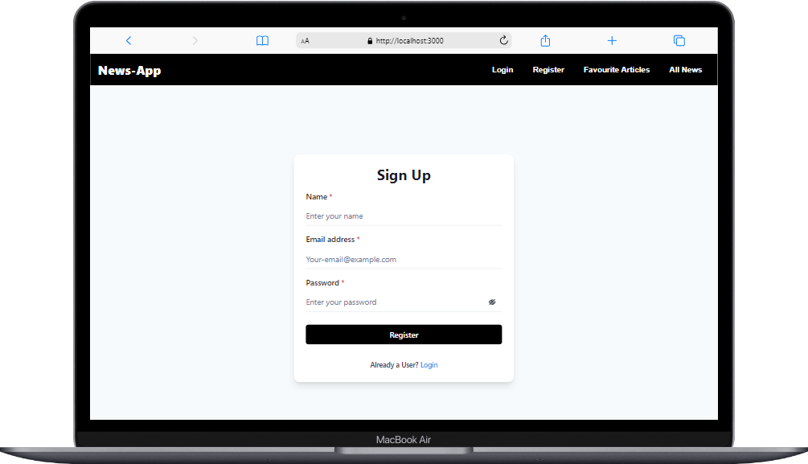
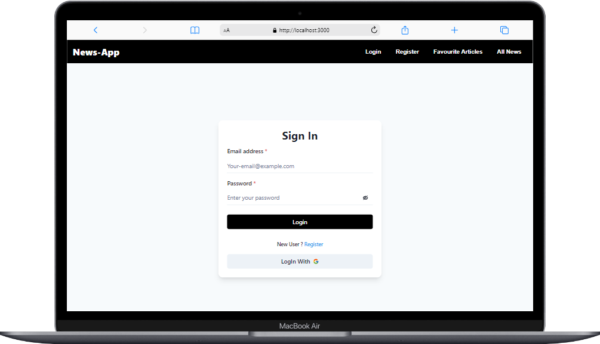

<h1 align="center">News App</h1>

<h3 align="center">It's a News Application</h3>

 

<h2 align="center">🖥️ Tech Stack</h2>

<h4 align="center">Frontend:</h4>

  
   
   
   
    

<h4 align="center">Deployed On:</h4>

  
 

 

## Signup 

 

## Login

 

## All News In Grid Form

 

## All News In List From

 

## Details Page

 

## Favourite News

 

## Getting Started

-> To get started with the project, follow these steps:

1. Clone the repository to your local machine.
2. Install the required dependencies by running npm install.
4. Start the frontend server by running npm run dev.
5. Open your browser and navigate to http://localhost:3000 to view the app.

# Deployed Link

### Frontend
https://news-app-with-firebase.netlify.app/login

